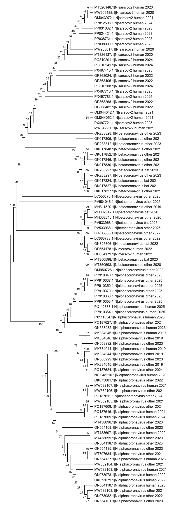

# Сравнение филогенетических деревьев коронавирусов, построенных по генам **S** и **N**

В ходе работы были построены два филогенетических дерева коронавирусов (95 таксонов):  
одно на основе **гена Spike (S)**, другое — на основе **гена Nucleocapsid (N)**.  
Оба дерева были получены методом UPGMA с 100 бутстрэп-репликами.

Точка входа для загрузки и подготовки файлов находится в run.sh
```sh
# Установка окружения и запуск
export CONDA_SUBDIR=osx-64
conda env create -f environment.yml
conda activate popgen
cd src
bash run.sh
# я понял, что я не записал id скачанных прочтений,
# а еще при получении списка id я их рандомно перемешивал без фиксирования seed
# воспроизвести 1в1 не получится:)
# но зато тут полный пайплайн
```

## Филогения по S


## Филогения по N


Ниже приведены ключевые наблюдения и сравнительный анализ.

## 1. Отличия между деревьями по гену **S** и **N**

### 1.1. Эволюционное разнообразие SARS-CoV-2

**S-дерево (Spike):**
- SARS-CoV-2 образует несколько небольших подкластеров.  
- Частично наблюдаются группировки по годам (2020–2025).  
- Многие узлы имеют умеренные или высокие bootstrap-значения.

**N-дерево (Nucleocapsid):**
- SARS-CoV-2 практически не разделяется по годам.  
- Последовательности 2020–2025 перемешаны.  
- Bootstrap-поддержка низкая.

---

### 1.2. Бета-коронавирусы (кроме SARS-CoV-2)

- В обоих деревьях бетакоронавирусы не очень хорошо разделяются на подгруппы:
  - «bat» (летучие мыши),
  - «other» (другие хозяйские виды).
- На S-дереве различия выражены хуже.

---

### 1.3. Положение **MERS-CoV**

- В обоих деревьях MERS-CoV образует отдельную ветвь.

---

### 1.4. Альфакоронавирусы

- В обоих деревьях альфакоронавирусы составляют самый крупный кластер.
- Устойчивые кластеры сложно выделить на обоих деревьях.

---

## 3. Сравнение эволюционных сигналов генов **S** и **N**

| Критерий | Ген S (Spike) | Ген N (Nucleocapsid) |
|----------|---------------|-----------------------|
| Разделение SARS-CoV-2 по годам | заметное | слабое/отсутствует |
| Bootstrap внутри SARS-CoV-2 | умеренный | низкий |
| Разделение видов/линий | отличное | хорошее |
| Подходит для анализа недавней эволюции | да | скорее нет |

**Главный вывод:**  
Ген **S** лучше подходит для анализа внутривидовой эволюции SARS-CoV-2 и для различения недавних линий.  
Ген **N** надёжнее отражает лишь глубокие эволюционные связи между различными коронавирусами.

---
